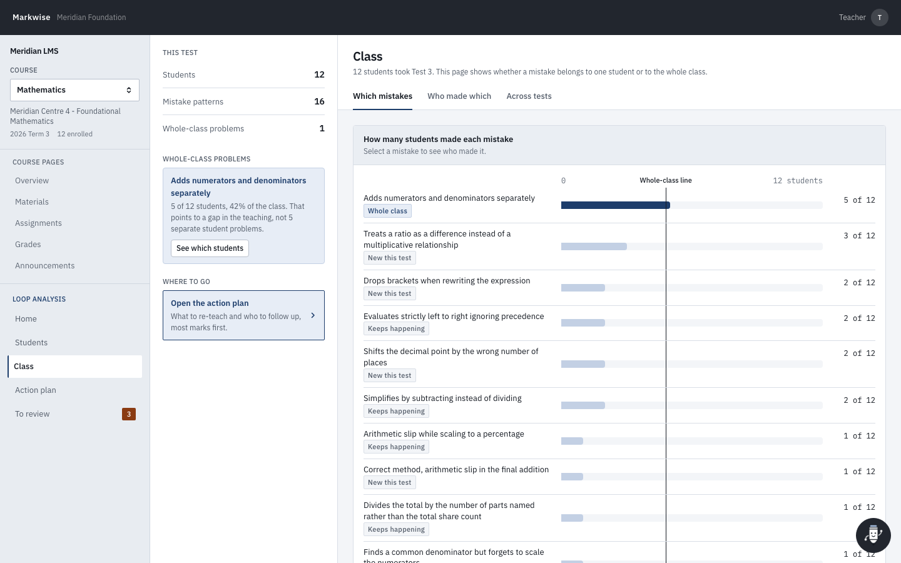

<div align="center">

# Markwise

**An agentic marking assistant for community facilitators. It marks a test, finds out *why* each student lost marks, and decides what the teacher should do next.**

Built for the **McKinsey x QuantumBlack AI Hackathon, Doha 2026**, Education theme.
Client: **Meridian Foundation**. Use case: **Marks and answer-sheet analysis**.

`LangGraph` · `FastAPI` · `React + TypeScript` · `Azure OpenAI via the QuantumBlack gateway` · `243 tests`

</div>

<table>
  <tr>
    <td width="33%"></td>
    <td width="33%"></td>
    <td width="33%"></td>
  </tr>
  <tr>
    <td align="center"><sub>The whole test at a glance</sub></td>
    <td align="center"><sub>Why a student lost marks, with evidence from their answer</sub></td>
    <td align="center"><sub>A note to the student, drafted and ready to send</sub></td>
  </tr>
</table>

## The problem

Meridian's 60,000 learners are taught mostly by community facilitators, not specialist teachers. Many learners study in a second language, and many leave and come back.

A marks sheet shows **who** scored what. It never shows:

- **why** each mark was lost,
- whether it is **the same mistake as last month**, or
- whether **half the class shares it**, which would make it a teaching gap rather than a problem with individual students.

Marking also uses up facilitator time, so feedback arrives too late to change anything.

## What Markwise does

A facilitator uploads a test. Six agents take it from there, and the facilitator stays in charge of every mark that counts.

| | What the agent decides | What the teacher sees |
|---|---|---|
| **Marks** | Awards draft marks against the marking scheme, each with a confidence | A draft total per student. Nothing counts until the teacher approves it |
| **Diagnoses** | Names the mistake pattern behind each lost mark, out of 24 known ones | The student's own answer, with the words it relied on highlighted |
| **Remembers** | Tracks each student's mistakes across tests, including students with gaps in their record | "Keeps happening" or "Once", per mistake |
| **Separates** | Decides whether a mistake belongs to one student or to the whole class (40 percent or more) | A heatmap of the class and the whole-class problems |
| **Plans** | Ranks what to do next within a fixed amount of teacher time, and records what it had to leave out | One ordered action plan: re-teach, catch-ups, restart points, pairings |
| **Escalates** | Hands over anything it should not decide alone, with both readings and what it would have chosen | A "Needs your call" queue with one-click accept or correct |
| **Re-plans** | When the teacher corrects a finding, re-runs the class analysis and rebuilds the plan | The plan changes in front of them, with each change marked |
| **Writes to students** | Drafts a personal note to each student from their own mistakes | An email the teacher edits and sends from the app |

## Features we are proudest of

**1. It emails students, safely.** From a student's page the facilitator presses *Write a note*. Markwise drafts a short, personal email: where the mistake was, what went wrong in plain words, and what to try next. The teacher can edit it, send themselves a test copy, and then send it for real over Gmail. A guard blocks any note that leaks an internal code such as `M01`, or mentions a mark, because marks are still drafts. Every note sent is logged on the student's page, and sending the same note twice asks for confirmation first. With no Gmail set up, the note is saved and labelled **not delivered**, never shown as sent.

**2. Language is never mistaken for maths.** A second-language learner who reaches the right answer but writes it awkwardly is **never** recorded as weak at maths. This is enforced in code, not asked for in a prompt: if the marking scheme's target value appears in the answer, a maths diagnosis is overruled whatever the model says. We added this rule after the model labelled a correct answer as a procedural mistake at 90 percent confidence.

**3. Evidence you can check.** Every diagnosis points to an exact piece of the student's own answer, highlighted in place. If the model quotes text that is not in the answer, the diagnosis is rejected.

**4. One correction changes the plan.** In the demo, "adds numerators and denominators separately" is made by 5 of 12 students (42 percent), so it counts as a whole-class problem and the plan includes a group re-teach. Overriding one diagnosis drops it to 4 of 12 (33 percent). The agent re-enters the graph at the cohort analyst, withdraws the group re-teach and moves the next items up the plan.

**5. It knows when to stop.** Low-confidence marks, two explanations that fit equally well, wording problems and thin records all go to the teacher with what the system would have done. It never just says "I am unsure".

**6. A helper that cites its sources.** The pencil helper answers questions such as *"Which topic is the class weakest at?"* from the analysis and the uploaded files. Its sources fold away until you open them.

<table>
  <tr>
    <td width="33%"></td>
    <td width="33%"></td>
    <td width="33%"></td>
  </tr>
  <tr>
    <td align="center"><sub>Needs your call: what it was unsure about and why</sub></td>
    <td align="center"><sub>One student's problem, or the whole class's?</sub></td>
    <td align="center"><sub>The action plan, most important first</sub></td>
  </tr>
</table>

## Agent workflow

<!-- TODO: add the designed diagram as docs/agent-workflow.png and uncomment the line below. -->
<!-- <p align="center"></p> -->
> The designed workflow diagram will go here. Until then, this is the same flow in text:

```
 LMS + teacher inputs          LangGraph orchestrator (shared state + trace)                 Teacher in the loop
 ────────────────────          ────────────────────────────────────────────                  ───────────────────
 test paper           ─┐                                                  ┌─ enough signal ─▶ Planner ─┐
 marking scheme        ├─▶ Intake ─▶ Marker ─▶ Diagnostician ─▶ Cohort ───┤                            ├─▶ Approve marks
 answer sheets         │              ▲           ▲            Analyst    └─ too little ───▶ insights ─┘   Send notes
 learner history      ─┘              └── Reviewer gate ───────┴──── (also gates the planner)              Override ─┐
                                   low confidence · ambiguity · language · thin history · budget                     │
                                                                  ▲                                                  │
                                                                  └──────── re-plan from the cohort analyst ─────────┘
```

| Agent | Role | If the model fails |
|---|---|---|
| Intake | Loads the test, scheme, answers and each learner's history from the LMS | No model used |
| Marker | Draft marks with a confidence per criterion | Rule-based marking from the scheme |
| Diagnostician | Names the mistake pattern, cites evidence and gives a runner-up | Rule-based diagnosis from the scheme |
| Cohort analyst | Splits individual problems from teaching problems | No model used |
| Planner | Proposes and scores actions. Code then fits them to the time budget | Rule-based plan |
| Reviewer gate | Escalates low confidence, ambiguity, language issues, thin history and budget overflow | No model used |

A dead model provider costs quality, never a run. After three failures a circuit breaker switches every agent to the deterministic rules. A run against a dead endpoint still completes in 1.5 seconds with full results. The full graph and state contract are in [`architecture.md`](architecture.md), and a test checks that its diagram matches the code.

## Measured, not claimed

Errors in the mock data are injected by **Python rules, never by a model**. If the same model had written the errors and then diagnosed them, the accuracy score would be self-graded. The backend is blocked from reading the answer key, and a check fails the evaluation if it ever does.

| Metric (Test 3, 12 learners, 96 answers) | Result |
|---|---|
| Correct mistake pattern named | **92%** (23 of 25), 96% before the reviewer gate |
| Correct pattern in the top two | 96% |
| Evidence quoted from the student's own answer | **100%** (31 of 31) |
| Second-language learners wrongly called weak at maths | **0** |
| Returning learners given a restart point | **100%** (3 of 3) |
| Full class, end to end | about 25 seconds |

Reproduce with `.venv/bin/python eval/evaluate.py`. The full table is in [`eval/results.md`](eval/results.md).

## Run it

```bash
git clone https://github.com/syedahmedkhaderi/lms-marks.git && cd lms-marks
./setup.sh && ./start.sh        # then open http://localhost:5173
```

- **It opens on a finished example**, so there is something to see straight away. Press *Analyse this test* to run it live.
- **No API key needed.** With no key it runs on deterministic rules. With `QB_CLIENT_ID` and `QB_CLIENT_SECRET` it uses the QuantumBlack gateway (`gpt-4.1-mini`). With `OPENAI_API_KEY` it calls OpenAI directly.
- **Email:** set `GMAIL_USER` and `GMAIL_APP_PASSWORD` in `.env` to send for real. Without them, notes are saved and marked as not delivered.

<details>
<summary><b>Two-minute demo script</b></summary>

1. **Home.** Test 3 is already analysed: class average, hardest questions, most common mistakes.
2. **Students, Thabo M.** He evaluates `2 + 3 x 4` left to right in Test 1 and Test 3, so it shows as "Keeps happening". Press *Write a note* to draft his email, edit it and send.
3. **Students, Liu Y.** She wrote the correct answer in awkward English. It gets full marks and no maths mistake is recorded.
4. **Class.** "Adds numerators and denominators separately" affects 5 of 12 students, so it is a whole-class problem.
5. **Action plan.** The group re-teach comes first, then restart points for the three returning learners.
6. **Students, Kwame A., Test 3 Question 4.** Choose *Correct this*, then *Not a misconception at all*. The count drops to 4 of 12, the group re-teach is withdrawn and the plan reorders.

</details>

<details>
<summary><b>Repository layout</b></summary>

```
backend/
  agents/        intake, marker, diagnostician, cohort_analyst, planner, reviewer, offline_rules
  graph.py       LangGraph wiring; GRAPH_EDGES is tested against architecture.md
  config.py      every threshold the graph branches on, in one place
  llm.py         the only module that talks to a model; never raises
  mailbox/       drafting, guard and Gmail delivery for student notes
  lms/           mock LMS API shaped like Canvas and Moodle
  routers/       uploads, email, chat, insights
data/            taxonomy (24 mistake patterns), marking schemes, personas, rule-based generator
eval/            evaluate.py and results.md
frontend/        React, Vite, TypeScript, Tailwind, TanStack Query
tests/           pytest, always offline
```

</details>

<details>
<summary><b>Design rules that each have a test</b></summary>

- The agent never sets a mark that counts. Every mark is a draft until a human approves it.
- The backend never reads the answer key.
- Evidence is quoted exactly from the student's answer, or the diagnosis is rejected.
- Language noise never changes the numbers in an answer, and never produces a maths diagnosis.
- The model may propose a plan, but it cannot drop a feedback note, a restart point or a required group re-teach.
- The planner fits the budget in code and records everything it left out.
- The architecture diagram matches the compiled graph.
- No model call can crash a run.
- An override re-plans from the cohort analyst, not from the start.

The full list, with reasons, is in [`AGENTS.md`](AGENTS.md).

</details>

<details>
<summary><b>Divergences from the original plan</b></summary>

`CODEX_BUILD_PLAN.md` is the original specification. Four deliberate divergences:

1. **Demo numbers.** The plan had a mistake held by 7 of 12 learners falling to 6 of 12 after an override and dropping below the 40 percent line. 6 of 12 is 50 percent, so that cannot happen. The personas are tuned so it lands on 5 of 12 (42 percent) and falls to 4 of 12 (33 percent).
2. **`backend/llm.py` and `backend/agents/offline_rules.py`** are not in the plan. The first is the single provider boundary, so the fallback is enforced in one place. The second is that fallback, and it is what lets the app run with no API key.
3. **The time budget is not a UI control.** The planner still fits a fixed budget in code and records what it dropped, but facilitators asked for one ordered list, not minutes.
4. **The accent is also the primary action colour.** The navy used for agent activity also marks the primary button. Rust still marks only what the agent handed to a human.

</details>
