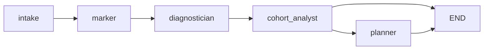
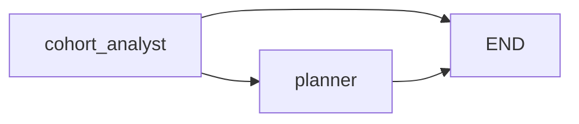

# LOOP architecture

This document describes the system as built. The diagram below is asserted
against the compiled graph by `tests/test_graph_matches_docs.py`, which parses
the mermaid block, extracts its edges, and fails if the set differs from
`backend.graph.GRAPH_EDGES` in either direction. A diagram that contradicts the
code cannot survive a green test run.

## The graph



Five nodes, six edges. `cohort_analyst` has two outgoing edges because of one
conditional: `backend.graph.has_enough_signal`.

### Why the reviewer is not on that diagram

The reviewer is not a node. It is a gate function in
`backend/agents/reviewer.py` called at the end of three nodes:

| Node | Gate called | Reason codes it can raise |
|---|---|---|
| `marker` | `gate_marks` | `LOW_MARK_CONFIDENCE`, `COUNTS_TOWARD_RECORD` |
| `diagnostician` | `gate_diagnoses` | `AMBIGUOUS_DIAGNOSIS`, `LANGUAGE_BARRIER` |
| `cohort_analyst` | `gate_sparse_history` | `SPARSE_HISTORY` |
| `planner` | `gate_plan` | `BUDGET_OVERFLOW` |

The gate appends to `state["escalations"]` and returns only the items that
survive, so escalated items are removed from what flows downstream. Drawing it
as a sixth node would imply an edge that does not exist in `build_graph()`. The
UI draws it as a dashed branch off the pipeline for the same reason.

`gate_sparse_history` is called from inside `cohort_analyst` rather than at its
exit, because the claim it is checking is formed mid-aggregation. `cohort_analyst`
is therefore listed in the table above but not in
`backend.graph.REVIEWER_GATED_NODES`, which names only the nodes whose exit runs
a gate over their whole output.

### The conditional edge

```
cohort_analyst --> planner        when len(state["diagnoses"]) >= MIN_DIAGNOSES_TO_PLAN
cohort_analyst --> END            otherwise
```

`MIN_DIAGNOSES_TO_PLAN` is 2. Below it the run ends with a trace event saying
there is not enough signal to plan, rather than producing a confident-looking
plan from two data points.

## The re-plan graph



`build_replan_graph()` contains only `cohort_analyst` and `planner`, and its
entry point is `cohort_analyst`.

A facilitator override does not invalidate the marking. The learner's answer has
not changed and neither has the scheme, so re-running the marker would burn
latency and could return a different answer, which would read as
non-determinism. `backend/service.py::apply_override` rehydrates the persisted
state, applies the correction, drops stale `BUDGET_OVERFLOW` escalations, and
invokes the re-plan graph on the existing marks and diagnoses.

## Data flow

```
data/generated/submissions.json
        |
        v
backend/lms/mock_api.py  ---- shaped like Canvas and Moodle REST endpoints
        |
        v
  intake ----> marker ----> diagnostician ----> cohort_analyst ----> planner
     |            |              |                    |                |
     |         [gate]         [gate]               [gate]           [gate]
     |            |              |                    |                |
     |            +--------------+--------------------+----------------+
     |                                   |
  SQLite                                 v
  error_profile                  state["escalations"]  ----> review queue
  (prior assessments)
```

`data/taxonomy.json` is read by the diagnostician (scoped to the question's
topic), the cohort analyst and the planner. It is a versioned, human-readable
artifact a subject expert can audit without touching code.

`data/ground_truth.json` is read by `eval/evaluate.py` and by nothing else.
`eval/evaluate.py` greps the `backend/` package for the string `ground_truth`
and fails if it finds it.

## State

`backend/state.py::LoopState` is the single object every node reads and writes.
The API serialises it directly, so the frontend contract and the graph contract
are the same thing.

| Key | Written by | Notes |
|---|---|---|
| `submissions` | intake | From the mock LMS |
| `learners` | intake | Includes `history_completeness` for returners |
| `marks` | marker | Post-gate survivors. `all_marks` holds the pre-gate set |
| `diagnoses` | diagnostician | Post-gate survivors. `all_diagnoses` holds the pre-gate set |
| `patterns` | cohort_analyst | Per-node counts, classification, teaching-problem flag |
| `plan` | planner | Scheduled and dropped actions, drafted feedback |
| `escalations` | reviewer gate | Appended from three nodes |
| `trace` | every node | Start and end events, plus decisions and warnings |
| `overrides` | service | Facilitator corrections |
| `changes` | service | Diff between the plan before and after a re-plan |

## Agents

| Agent | Deterministic | Model calls | Output |
|---|---|---|---|
| Intake | yes | none | Submissions, learner contexts, history completeness |
| Marker | MCQ only | one per written question, all learners batched | Provisional marks with confidence |
| Diagnostician | MCQ via distractor map | one per written error | Named misconception, evidence span, runner-up |
| Cohort analyst | yes | none | Shared, recurring, emerging, or a refusal to call |
| Planner | budget fitting | one to propose actions, one per learner for feedback | Scheduled actions, dropped actions with reasons |
| Reviewer | yes | none | Escalations with six reason codes |

### Where the model is and is not allowed to decide

The planner proposes candidate actions and scores their severity with a model
call. The budget is then filled **in code**, greedily by severity, in
`planner._fit_budget`. Everything that did not fit is recorded with
`drop_reason` and shown in the UI. An agent allowed to fit its own plan to the
budget would quietly trim until it fitted, and the trade-off is the thing worth
showing.

Marking a mark as final is not a decision the agent can make at all. Every
`Mark` carries `provisional=True` until a human calls `/api/batch/{id}/approve`.

### Evidence spans

`Diagnosis.evidence_span` must be a verbatim substring of the learner's answer.
`diagnostician._diagnose_written` checks this and rejects the model's diagnosis
if the span is not found, falling back to the rule engine at reduced confidence.
`tests/test_evidence_spans.py` asserts the property holds across a full run.

## Providers and offline mode

`backend/config.py::PROVIDER` resolves once at import:

| Credentials | Provider | Fast model | Smart model |
|---|---|---|---|
| `QB_CLIENT_ID` + `QB_CLIENT_SECRET` | `azure` | `gpt-4.1-mini` | `gpt-4.1-mini` |
| `OPENAI_API_KEY` | `openai` | `gpt-4o-mini` | `gpt-4o` |
| neither, or `LOOP_OFFLINE=1` | `offline` | none | none |

Model choice was measured against this project's real prompts rather than
assumed. On the gateway, `gpt-4.1-mini` returns a batched marking call in about
7 seconds where `gpt-4o-mini` takes 14, diagnoses in under 3, and scored 96
percent recovery against `gpt-5.4`'s 92. It is both the fastest and the most
accurate option here, so it is the default for both tiers. The two tiers remain
separate so a deployment can raise either independently.

Structured output uses strict `json_schema`. Without it the smaller models
quietly omit a required field, validation fails, and the agent silently falls
back to rules while still reporting itself as running on the model.

`backend/llm.py` is the only module that knows which provider is in use, and it
exposes `call` for a single request and `call_many` for independent requests,
which are fanned out across a thread pool. Marking a cohort, diagnosing every
error and drafting every learner's feedback are all independent, so they run
concurrently, and the planner's proposal call overlaps its feedback drafting.
Marking is chunked at `MARK_BATCH_SIZE` learners per call, because a response
carrying the whole cohort is long and output length is what latency is made of.

A full run went from 190 seconds serial to about 20.

## Progress reporting

The graph runs on a worker thread, so its state only reaches the API when the
whole run finishes. That is far too late for a UI meant to show the agents
working, so `state.trace` publishes every event to a live buffer the moment it
happens, and `/api/batch/{id}/trace` reads from there. `llm.call_many` takes an
`on_progress` callback, which the marker, diagnostician and planner use to emit
an event per completed call. A ten second model step with no output is
indistinguishable from a hang, and the pipeline panel is the main evidence that
this is an agent system rather than a dashboard.

With no credentials, `backend/config.py::OFFLINE` is true and every model
call returns `None`. Each agent falls back to `backend/agents/offline_rules.py`,
a deterministic engine that reads the marking scheme and the taxonomy. The
system runs end to end with no key and no network.

This is also the crash floor: `backend/llm.py::call` catches every exception and
returns `None`, so a provider outage degrades to rules rather than showing a
stack trace.

Honest caveat, repeated in `eval/results.md`: the offline rules encode the same
mathematics the generator used to inject the errors, so a recovery rate measured
in offline mode is a check that the pipeline is wired correctly, not a
measurement of model quality.

## Stack

| Layer | Choice |
|---|---|
| Orchestration | LangGraph `StateGraph` with a conditional edge |
| LLM plumbing | `langchain-core` for messages, `langchain-openai` for the client, structured output only |
| API | FastAPI, uvicorn |
| Storage | SQLite via the `sqlite3` stdlib, no ORM. Schema in `backend/db.py` |
| Frontend | React 18, Vite, TypeScript, Tailwind, TanStack Query |

`backend/llm.py` is the only module that imports `langchain_openai`. Swapping
providers is a change to that one file.
